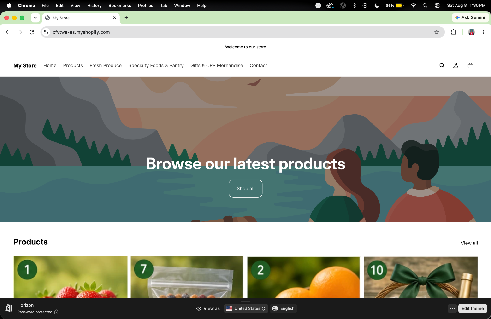
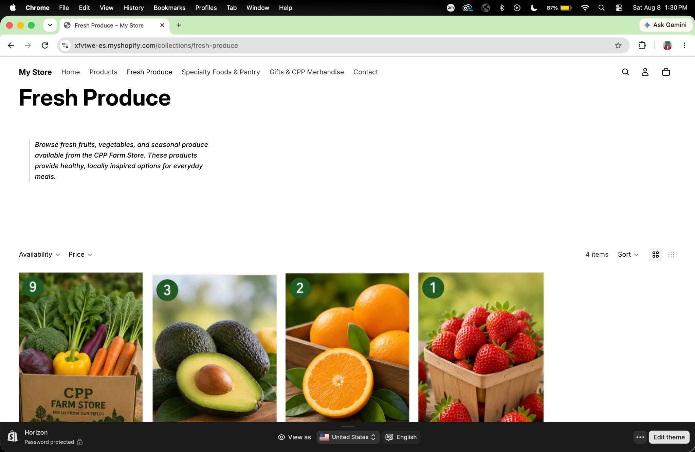
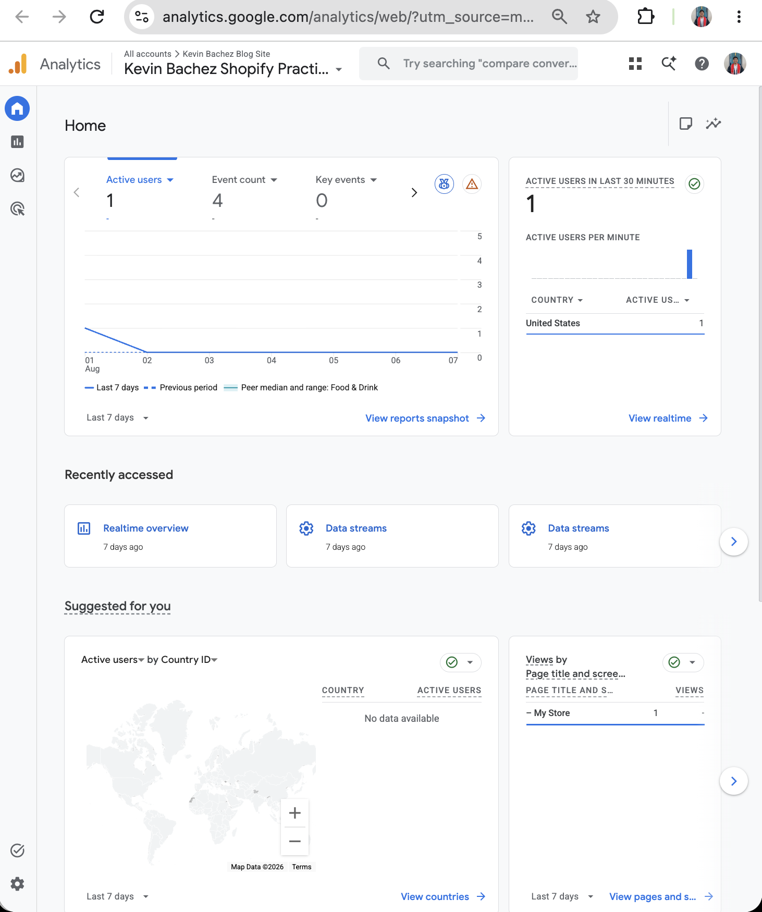

# TP-W10-Shopify Store - Assignment 8

# Store Testing and Analytics Review

# Introduction

The purpose of this assignment is to test the CPP Farm Store Shopify prototype from a customer's perspective and review available analytics data. The CPP Farm Store offers agricultural products, fresh produce, food items, and merchandise connected to Cal Poly Pomona.

For this test, I followed the customer journey from the homepage to a collection page, product page, and shopping cart. I also reviewed available Google Analytics 4 data to evaluate whether customer activity was being tracked correctly.

# 1. Customer Journey Test

## Homepage

I began the customer journey on the CPP Farm Store homepage. I reviewed the store as if I were a first-time customer and checked whether the store's navigation, products, and overall shopping experience were easy to understand.

The homepage provides access to the main navigation menu and featured products. Customers can navigate to Products, Fresh Produce, Specialty Foods & Pantry, Gifts & CPP Merchandise, and Contact.

The homepage also includes a "Shop all" button that allows customers to begin browsing products.

## Screenshot 1: CPP Farm Store Homepage

The homepage served as the starting point of the customer journey. It provides access to the main navigation menu, featured products, and a "Shop all" button that directs customers toward the product catalog.

## Collection Page

Next, I navigated from the homepage to the Fresh Produce collection.

The Fresh Produce collection displayed four products, including a seasonal vegetable box, avocados, oranges, and strawberries.

The collection page also included availability and price filters as well as sorting options. These features make it easier for customers to browse and compare products.

## Screenshot 2: Fresh Produce Collection

The Fresh Produce collection organizes the available products in one location and gives customers filtering and sorting options that can make the shopping process more efficient.

## Product Page and Shopping Cart

I selected CPP Fresh Strawberries from the Fresh Produce collection and reviewed the individual product page.

The product page displayed the product image, product name, price of $6.99, quantity selector, Add to Cart button, Buy It Now option, and product description.

I then added one CPP Fresh Strawberries item to the shopping cart. The cart correctly displayed the selected product, quantity of one, price of $6.99, and estimated total of $6.99.

I did not complete a real transaction because the purpose of this assignment was to test the shopping experience without making an actual purchase.

## Screenshot 3: CPP Fresh Strawberries and Shopping Cart

This screenshot confirms that the selected product was successfully added to the shopping cart and that the correct product, quantity, and price were displayed.

Overall, the customer journey successfully allowed me to move from the homepage to the Fresh Produce collection, individual product page, and shopping cart without experiencing a major navigation problem.

# 2. Store Strengths

## Strength 1: Organized Product Categories

One strength of the CPP Farm Store Shopify prototype is its organized product categories.

Customers can browse categories including Fresh Produce, Specialty Foods & Pantry, and Gifts & CPP Merchandise. Organizing products into categories makes it easier for customers to locate the type of product they are interested in purchasing.

The Fresh Produce collection also includes filters and sorting options that can help customers browse products more efficiently.

## Strength 2: Clear Product Pages

Another strength is the individual product page design.

The CPP Fresh Strawberries product page clearly displays the product image, product name, $6.99 price, description, quantity selector, and purchasing options.

Providing this information in one location makes it easier for customers to understand the product and decide whether they want to add it to their shopping cart.

## Strength 3: Simple Customer Journey

The store provides a simple and understandable shopping journey.

I was able to move from the homepage to the Fresh Produce collection, select CPP Fresh Strawberries, and add the product to the shopping cart without unnecessary steps.

The main navigation menu also remains available throughout the shopping experience, allowing customers to move between different product categories easily.

# 3. Areas for Improvement

## Improvement 1: Store Branding

One area that should be improved is the store branding.

The Shopify prototype currently displays generic text such as "My Store" and "Welcome to our store."

Before the final submission, I plan to replace this text with CPP Farm Store branding so customers can immediately recognize the retailer when entering the website.

## Improvement 2: Homepage Presentation

The homepage could provide more information specifically related to the CPP Farm Store.

The current homepage includes the message "Browse our latest products." While this helps direct customers toward the store's products, the homepage could be improved by including information about the CPP Farm Store, locally available produce, featured products, or store pickup.

This would create a stronger connection between the Shopify prototype and the physical CPP Farm Store.

## Improvement 3: Product Information

Some product pages could include additional information to help customers make purchasing decisions.

For example, fresh produce pages could include information about quantity, weight, sourcing, seasonal availability, pickup options, or storage recommendations.

Adding more detailed product information could make the online shopping experience more informative and professional.

# 4. Analytics Review

I reviewed Google Analytics 4 to confirm that activity from the Shopify store was being tracked.

During my testing, the GA4 dashboard displayed 1 active user and an event count of 4. The dashboard also showed 1 active user within the last 30 minutes from the United States.

This provides evidence that the Shopify store is sending customer activity to Google Analytics 4.

## Screenshot 4: Google Analytics 4

Google Analytics 4 can help the CPP Farm Store understand how visitors interact with the online store.

Analytics could eventually be used to measure active users, sessions, page views, traffic sources, engagement, product interest, and conversion behavior.

This information can help retailers better understand customer behavior and determine which parts of the online shopping experience are performing well.

# 5. Improvement Plan

Before the final Shopify project submission, I plan to improve the overall presentation and customer experience of the CPP Farm Store prototype. One of my main priorities will be replacing generic store text such as "My Store" and "Welcome to our store" with CPP Farm Store branding. I also plan to improve the homepage so that it communicates more information about the Farm Store and its products. In addition, I will review product descriptions and add more useful product information where appropriate. Finally, I will test the customer journey again on both desktop and mobile devices and continue reviewing Shopify and GA4 analytics to confirm that customer activity is being tracked correctly.

# Conclusion

The customer journey test showed that the main shopping experience of the CPP Farm Store Shopify prototype is functioning correctly.

I was able to begin on the homepage, navigate to the Fresh Produce collection, select CPP Fresh Strawberries, review the product information, and add the product to the shopping cart.

The shopping cart correctly displayed one CPP Fresh Strawberries item for $6.99 with an estimated total of $6.99.

The testing process also helped identify areas for improvement, particularly store branding, homepage presentation, and product information.

Finally, reviewing Google Analytics 4 confirmed that website activity is being recorded. This analytics information could eventually help the CPP Farm Store evaluate customer behavior and improve its ecommerce and omnichannel strategy.

# Appendix

## GitHub Pages

[View Published Assignment](<https://kebachez.github.io/Assignment-8---Store-Testing-and-Analytics-Review/>)

## GitHub Repository

[View GitHub Repository](<https://github.com/kebachez/Assignment-8---Store-Testing-and-Analytics-Review.git>)
